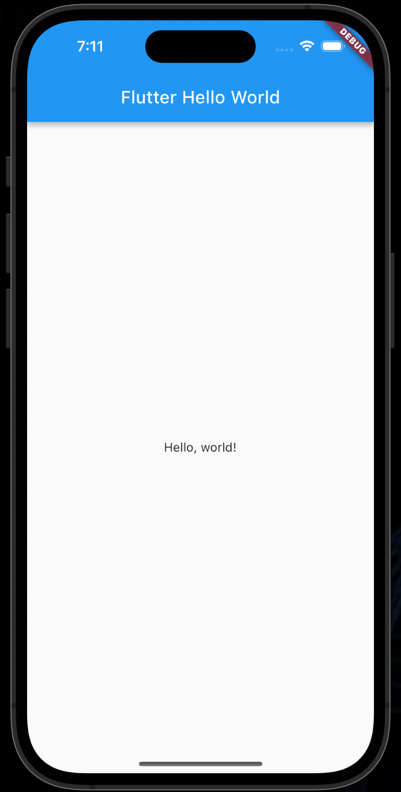
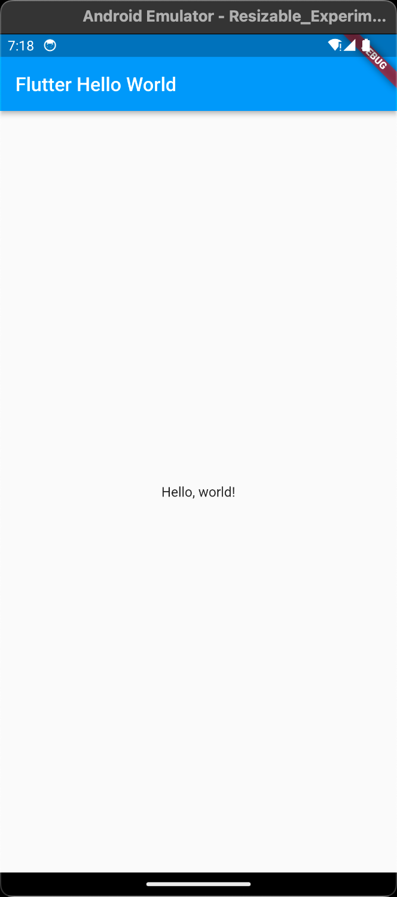
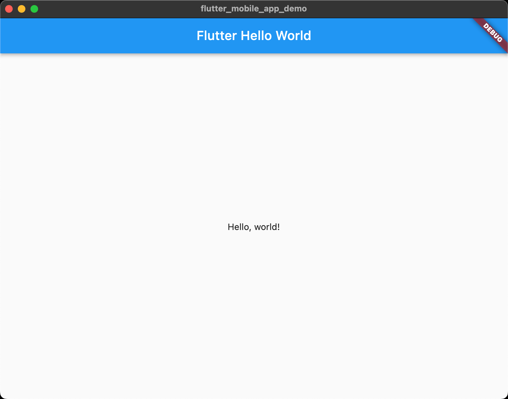
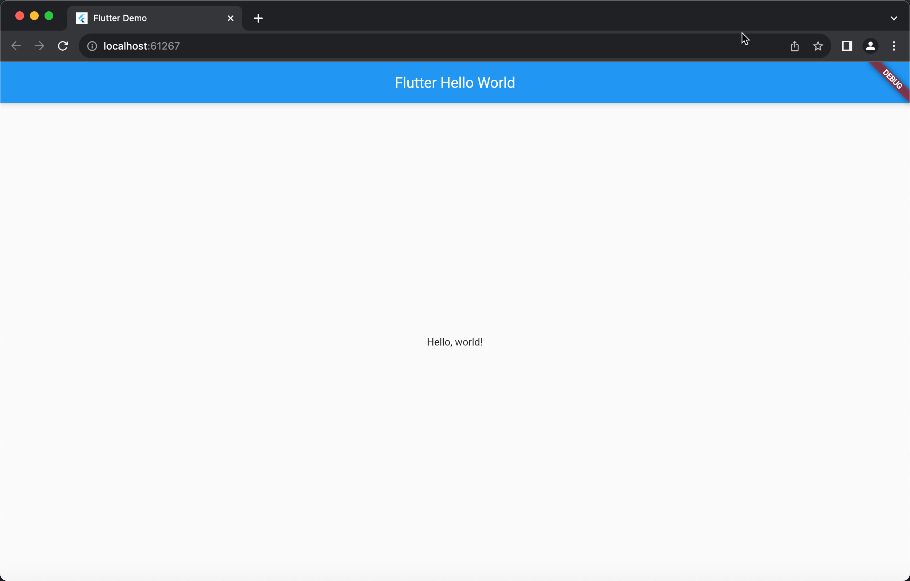

<!-- Begin README -->

<div align="center">
    <a href="https://github.com/scottgriv/flutter-mobile_app_demo" target="_blank">
        
    </a>
</div>
<br>
<p align="center">
    <a href="https://flutter.dev/"></a>
    <br>
    <a href="https://github.com/scottgriv"></a>
    <a href="mailto:scott.grivner@gmail.com"></a>
    <a href="https://www.buymeacoffee.com/scottgriv"></a>
    <br>
    <a href="https://prgoptimized.com" target="_blank"></a>
</p>

---------------

<h1 align="center">Flutter Mobile App Demo</h1>

A simple Flutter "Hello World" demo application. One codebase written in `Dart` for many platforms.
- Demonstrates Flutter's ability to create a single codebase for iOS, Android, MacOS, and Web.

<div align="center">
    <i>One codebase works for...</i>
</div>
<div align="center">
    <a href="https://flutter.dev/" target="_blank">
        
    </a>
    <br>
    <i>iOS!</i>
</div>

<div align="center">
    <a href="https://flutter.dev/" target="_blank">
        
    </a>
    <br>
    <i>Android!</i>
</div>

<div align="center">
    <a href="https://flutter.dev/" target="_blank">
        
    </a>
    <br>
    <i>MacOS!</i>
</div>

<div align="center">
    <a href="https://flutter.dev/" target="_blank">
        
    </a>
    <br>
    <i>Web...and more!</i>
</div>

---------------

## Table of Contents

- [Getting Started](#getting-started)
- [Resources](#resources)
- [License](#license)
- [Credits](#credits)

## Getting Started

> [!IMPORTANT] 
> Before beginning, make sure you install Flutter and Dart on your machine.
> Also, install Xcode and Android Studio to run the app on iOS and Android simulators.

1. Clone the repo.
```bash
git clone https://github.com/scottgriv/flutter-mobile_app_demo.git
```

2. Install Flutter and Dart:
```bash
brew install flutter
brew install dart
```

3. Install Xcode and Android Studio
```bash
brew install --cask xcode
brew install --cask android-studio
```

4. Run Flutter Doctor to check for any issues
```bash
flutter doctor
```

5. Run the app
```bash
flutter run
```
> [!TIP]
> You may need to rename the base folder from "flutter-mobile_app_demo" to "flutter_mobile_app_demo" to avoid any issues with the Flutter CLI.
> Flutter doesn't like the hyphens...***but I do.***

## Resources

- [Flutter](https://flutter.dev/)
- [Flutter Documentation](https://docs.flutter.dev/)
- [Lab: Write your first Flutter app](https://docs.flutter.dev/get-started/codelab)
- [Cookbook: Useful Flutter samples](https://docs.flutter.dev/cookbook)

## License

This project is released under the terms of **The Unlicense**, which allows you to use, modify, and distribute the code as you see fit. 
- [The Unlicense](https://choosealicense.com/licenses/unlicense/) removes traditional copyright restrictions, giving you the freedom to use the code in any way you choose.
- For more details, see the [LICENSE](LICENSE) file in this repository.

## Credits

**Author:** [Scott Grivner](https://github.com/scottgriv) <br>
**Email:** [scott.grivner@gmail.com](mailto:scott.grivner@gmail.com) <br>
**Website:** [scottgrivner.dev](https://www.scottgrivner.dev) <br>
**Reference:** [Main Branch](https://github.com/scottgriv/flutter-mobile_app_demo) <br>

---------------

<div align="center">
    <a href="https://github.com/scottgriv" target="_blank">
        
    </a>
</div>

<!-- End README -->
